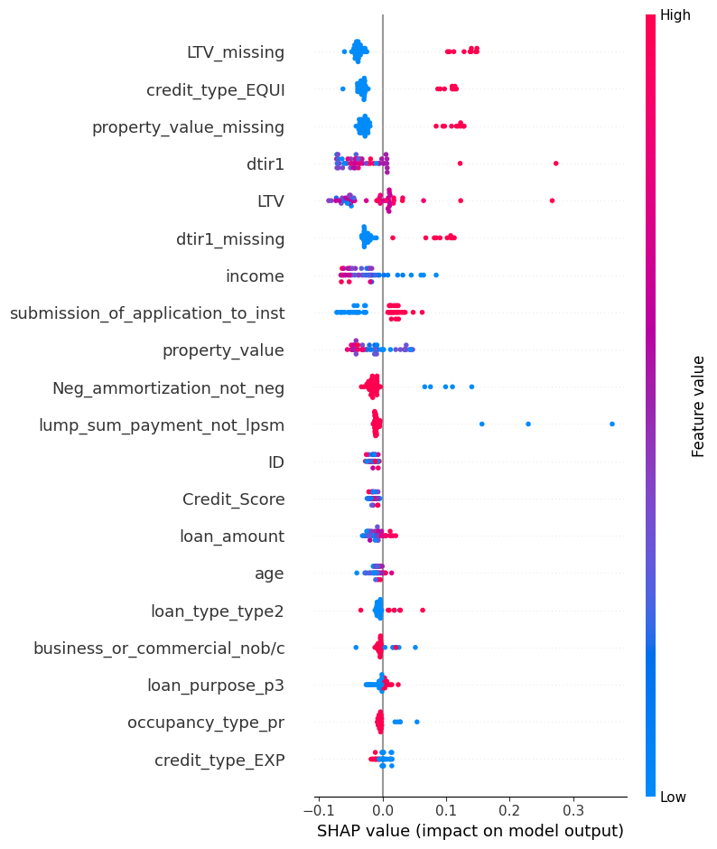

# Loan Default Prediction

Predicting mortgage loan default on a real-world dataset of ~148,670 loans - not just fitting a model, but working out why over 40% of some columns were missing before deciding what to do about it, and tuning the decision threshold to match what actually matters in a lending context.

*(Replace this with a screenshot from your notebook - the SHAP summary plot or the confusion matrix works well. Export it as a PNG, commit it to a visuals/ folder, and update the path above.)*

---

## About This Project

I built this to go beyond "train a model, report accuracy" and actually reason through the messier parts of a real dataset: which missing values are just missing, and which ones are quietly leaking information about the outcome. That distinction turned out to be the most interesting part of the whole project.

**Dataset:** [Kaggle Loan Default Dataset](https://www.kaggle.com/datasets/yasserh/loan-default-dataset), ~148,670 mortgage loan records, ~24.6% default rate.

## The Story

The project started as a standard classification exercise, but two columns, rate_of_interest and Interest_rate_spread, were missing in almost exactly the same count as loans that defaulted. That's not a coincidence you can just impute away. Digging into it: these fields are only populated once a loan is fully processed under normal terms, so if a loan defaulted, that step often never happened. Filling them in with the mean would have meant quietly leaking the outcome into the input features.

The fix was to drop those fields outright, but that raised the next question: were other missing columns the same kind of problem? property_value was missing in 41% of defaults vs. ~0% of non-defaults, a similarly suspicious pattern. The difference: property_value is knowable before a loan is approved (or not), it just wasn't always collected. So instead of dropping it, I kept it as a missingness flag, a new binary column recording whether the value was originally missing, and only then imputed the underlying number.

That decision paid off later: when I ran SHAP on the tuned Random Forest, the missingness flags (LTV_missing, property_value_missing, dtir1_missing) came out as the most influential features in the entire model, more important than income, credit score, or loan amount. The fact that a value was missing carried more signal than the value itself.

## What's Implemented

- Full leakage audit: distinguishing "missing because leaked" vs. "missing because knowable" columns
- Missingness-flag feature engineering (preserves the signal instead of erasing it during imputation)
- Mean/median vs. mode imputation, chosen per-column based on distribution shape
- Cardinality-aware encoding (ordinal mapping for age, one-hot for the rest)
- Three model families compared head-to-head: Logistic Regression, Random Forest, and a small neural network
- Manual decision-threshold tuning (0.5 to 0.35 to 0.25) instead of accepting the default 50% cutoff
- SHAP interpretability: summary plot + a dependence plot on income

## What's Next

- Hyperparameter tuning (grid/random search) on the Random Forest and neural network
- A cost-sensitive framing: assign real dollar costs to false positives vs. false negatives instead of optimizing F1
- Package the best model + threshold behind a small Streamlit or Flask demo
## Results

| Model | Accuracy | Precision | Recall | F1 | ROC-AUC |
|---|---|---|---|---|---|
| Logistic Regression (0.5 threshold) | 86.9% | 94.4% | 49.9% | 65.3% | 0.745 |
| Logistic Regression (0.35 threshold) | 86.3% | 83.0% | 56.0% | 66.9% | n/a |
| Random Forest | 89.1% | 94.9% | 59.0% | 72.7% | 0.790 |
| Neural Network | 86.2% | 71.3% | 73.4% | 72.4% | 0.819 |

No single model wins on every metric: Random Forest has the best precision and F1, the neural network catches the most real defaulters (best recall) and ranks risk best overall (best ROC-AUC). Which one you'd actually deploy depends on whether a missed defaulter or a false alarm costs the lender more.

## The Hardest Part

Getting the logistic regression baseline to converge, then getting it to convergence correctly. The first run threw a ConvergenceWarning because features like property_value (up to ~16 million) and age (0 to 6) sit on wildly different scales, and the optimizer couldn't settle. Scaling fixed that, but it surfaced a second, subtler issue: the scaler has to be fit on the training data only and then just applied to the test data, otherwise information from the test set leaks into preprocessing, the same leakage principle from earlier in the project, just showing up in a different place.

## Tools

Python, pandas, scikit-learn, Keras/TensorFlow, SHAP, matplotlib

## About the Developer

**Khadi(ja)**, Data Analyst based in Luxembourg, currently in the AI Academy at Digital Learning Hub Luxembourg, training as an ML Engineer.
[LinkedIn](https://www.linkedin.com/in/khadija-mustafa-98344527b/) · [Portfolio](https://khadijatheanalyst.github.io) · [GitHub](https://github.com/KhadijaTheAnalyst)

---
License: MIT
